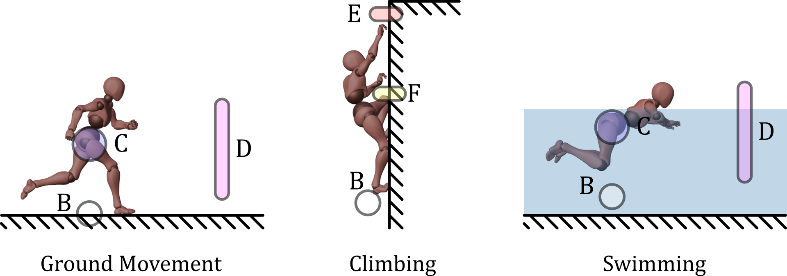

# Overview
This is a Unity demo for an auxillary paper written at the Technical University of Munich. We explore the possibilities of a reactive character control system based around subscriptions and sensors. In our system, subscriptions manage functions connected to sensors while sensors can be anything from volumetric colliders and raycasts to timers or user input. We use a state machine approch to handle the base logic of interactios while the sensors inform the state machine about the environment, motivating animations, state changes and camera movement. The set of implemented features is chosen by an analysis of the current top 20 games in the broader action adventure genre.

This project is a work in progress. The auxillary paper will be submitted in april 2025.

# States of Movement
The following is a non-exhaustive list of summaries of states that are currently implemented or being worked on. Future versions will include more states including jumps and some parcour.
## Ground Movement
The player character moves horizontally across a hard surface using bipedal movements of varying speed

**Movement input** is applied continuously on the xz-Plane relative to the camera direction.

**Gravity** Yes

**The camera** can orbit around the player freely with a clamped pitch while avoiding clipping into ground or obstacles. When moving forward it should be placed behind the player looking over the player's shoulder (Right shoulder for right-handed characters) into the direction the player is facing.

## Climbing

The player character moves along a hard surface orthogonal the the ground.

**Movement input** is applied continuously relative to the player character's orientation.

**Gravity** No

**The camera** can orbit around the player freely with a clamped pitch while avoiding clipping into ground or obstacles.

## Swimming

The player character moves on the surface of a body of liqud, propelled by his own arms and legs.

**Movement input** should not be applied continuously but in waves with the character's swimming motion.

**Gravity** No

**The camera** can orbit around the player freely with a clamped pitch while avoiding clipping into ground or obstacles. When the camera is below the water's surface, a post-processing filter is applied, giving the sense of being under water. 

# Author and Attributions
This demo was built by Tobias Heller (TUM) in combination with a paper written at the chair of Augmented Reality at TUM under the supervision of Daniel Dyrda M. Sc. (TUM) and Dr. rer. nat. David Plecher (TUM).

We make heavy use of Cysharp's R3 for observables: https://github.com/Cysharp/R3.

Animations from Mixamo: https://www.mixamo.com/
